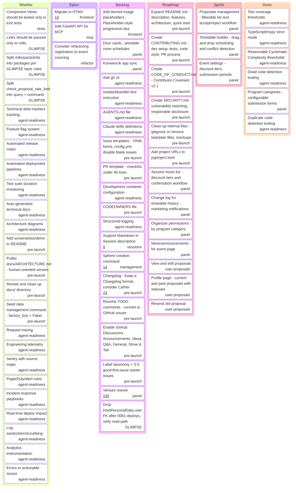

# TODO

```mermaid
---
config:
  kanban:
    ticketBaseUrl: 'https://github.com/fancysnake/ludamus/issues/#TICKET#'
---
kanban
  Wishlist
    [Component Views should be tested only in e2e tests]@{ assigned: 'tests' }
    [Links should be passed only to mills]@{ assigned: 'GLIMPSE' }
    [Split mills/pacts/inits into packages per GLIMPSE layer rules]@{
      assigned: 'GLIMPSE'
    }
    [Split check_proposal_rate_limit into query + command]@{
      assigned: 'GLIMPSE'
    }
    [Technical debt markers tracking]@{ assigned: 'agent-readiness' }
    [Feature flag system]@{ assigned: 'agent-readiness' }
    [Automated release notes]@{ assigned: 'agent-readiness' }
    [Automated deployment pipelines]@{ assigned: 'agent-readiness' }
    [Test suite duration monitoring]@{ assigned: 'agent-readiness' }
    [Auto-generated technical docs]@{ assigned: 'agent-readiness' }
    [Architecture diagrams]@{ assigned: 'agent-readiness' }
    [Add screenshots/demo to README]@{ assigned: 'pre-launch' }
    [Public docs/ARCHITECTURE.md - human-oriented version]@{
      assigned: 'pre-launch'
    }
    [Review and clean up docs/ directory]@{ assigned: 'pre-launch' }
    [Seed data management command - factory_boy + Faker]@{
      assigned: 'pre-launch'
    }
    [Request tracing]@{ assigned: 'agent-readiness' }
    [Engineering telemetry]@{ assigned: 'agent-readiness' }
    [Sentry with source maps]@{ assigned: 'agent-readiness' }
    [PagerDuty/alert rules]@{ assigned: 'agent-readiness' }
    [Incident response playbooks]@{ assigned: 'agent-readiness' }
    [Real-time deploy impact]@{ assigned: 'agent-readiness' }
    [Log sanitization/scrubbing]@{ assigned: 'agent-readiness' }
    [Analytics instrumentation]@{ assigned: 'agent-readiness' }
    [Errors to actionable issues]@{ assigned: 'agent-readiness' }

  Epics
    [Migrate to HTMX]@{ assigned: 'frontend', ticket: 10 }
    [Add FastAPI API for MCP]@{ assigned: 'mcp' }
    [Consider refactoring registration to event sourcing]@{
      assigned: 'refactor'
    }

  Backlog
    [Add blurred image placeholders - Plaiceholder-style progressive blur]@{
      assigned: 'frontend'
    }
    [Door cards - printable room schedules]@{ assigned: 'panel' }
    [Konwencik app sync]@{ assigned: 'panel' }
    [Add gh cli]@{ assigned: 'agent-readiness' }
    [Isolated/parallel test execution]@{ assigned: 'agent-readiness' }
    [AGENTS.md file]@{ assigned: 'agent-readiness' }
    [Claude skills definitions]@{ assigned: 'agent-readiness' }
    [Issue templates - YAML forms, config.yml, disable blank issues]@{
      assigned: 'pre-launch'
    }
    [PR template - checklist, under 40 lines]@{ assigned: 'pre-launch' }
    [Development container configuration]@{ assigned: 'agent-readiness' }
    [CODEOWNERS file]@{ assigned: 'pre-launch' }
    [Structured logging]@{ assigned: 'agent-readiness' }
    [Support Markdown in Session.description]@{
      assigned: 'sessions'
      ticket: 9
    }
    [Sphere creation command]@{ assigned: 'management', ticket: 14 }
    [Changelog - Keep a Changelog format, consider CalVer]@{
      assigned: 'pre-launch'
      ticket: 23
    }
    [Resolve TODO comments - convert to GitHub issues]@{
      assigned: 'pre-launch'
    }
    [Enable GitHub Discussions - Announcements, Ideas, Q&A, General, Show & Tell]@{
      assigned: 'pre-launch'
    }
    [Label taxonomy + 3-5 good-first-issue starter issues]@{
      assigned: 'pre-launch'
    }
    [Venues rework]@{ assigned: 'panel', ticket: 155 }
    [Drop HostPersonalData.user FK after 0061 deploys, unify read path]@{
      assigned: 'GLIMPSE'
    }

  Roadmap
    [Expand README.md - description, features, architecture, quick start]@{
      assigned: 'pre-launch'
    }
    [Create CONTRIBUTING.md - dev setup, tests, code style, PR process]@{
      assigned: 'pre-launch'
    }
    [Create CODE_OF_CONDUCT.md - Contributor Covenant v2.1]@{
      assigned: 'pre-launch'
    }
    [Create SECURITY.md - vulnerability reporting, responsible disclosure]@{
      assigned: 'pre-launch'
    }
    [Clean up internal files - gitignore or remove task/plan files, mockups]@{
      assigned: 'pre-launch'
    }
    [Add project URLs to pyproject.toml]@{ assigned: 'pre-launch' }
    [Session hosts list - discount tiers and confirmation workflow]@{
      assigned: 'panel'
    }
    [Change log for timetable history - marketing notifications]@{
      assigned: 'panel'
    }
    [Organizer permissions - by program category]@{ assigned: 'panel' }
    [News/announcements - for event page]@{ assigned: 'panel' }
    [View and edit proposals]@{ assigned: 'user-proposals' }
    [Profile page - current and past proposals with statuses]@{
      assigned: 'user-proposals'
    }
    [Resend old proposal]@{ assigned: 'user-proposals' }

  Sprint
    [Proposals management - filterable list and accept/reject workflow]@{
      assigned: 'panel'
    }
    [Timetable builder - drag-and-drop scheduling and conflict detection]@{
      assigned: 'panel'
    }
    [Event settings - discount tiers, submission periods]@{ assigned: 'panel' }

  Done
    [Test coverage thresholds]@{ assigned: 'agent-readiness' }
    [TypeScript/mypy strict mode]@{ assigned: 'agent-readiness' }
    [Reasonable Cyclomatic Complexity thresholds]@{
      assigned: 'agent-readiness'
    }
    [Dead code detection tooling]@{ assigned: 'agent-readiness' }
    [Program categories - configurable submission forms]@{ assigned: 'panel' }
    [Duplicate code detection tooling]@{ assigned: 'agent-readiness' }
```
